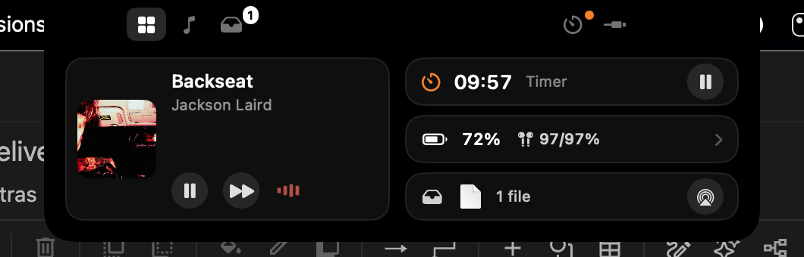
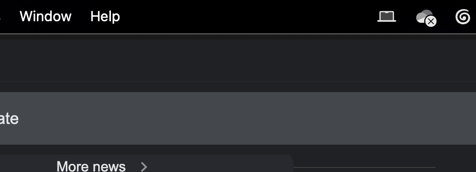
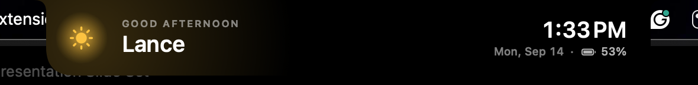
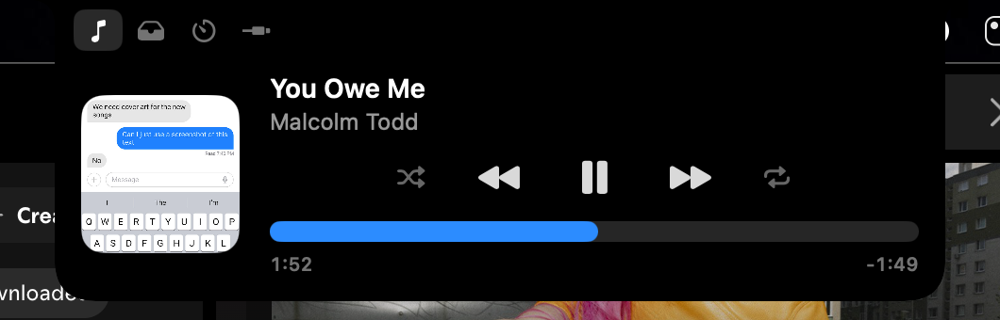
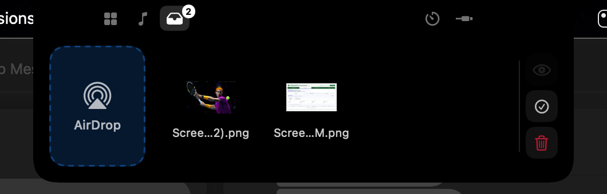
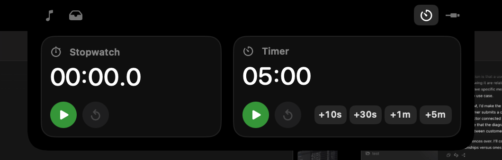

# NotchKo

**Turn your MacBook's notch into a Dynamic Island — without draining your battery.**

<p align="center">
  
</p>

Hover the notch (or press <kbd>⌃</kbd><kbd>⌥</kbd><kbd>N</kbd>) and it opens. Move away and it tucks back in.
While it's closed it uses **0% CPU** — it only wakes up when something actually happens.

<p align="center">
  
</p>

---

## Install (about 3 minutes)

You'll need a Mac running **macOS 14 Sonoma or newer**. A notch is *not* required —
on a Mac without one, or on an external monitor, it draws a small black pill at the top instead.

### Step 1 — open Terminal

Press <kbd>⌘</kbd> + <kbd>Space</kbd>, type **Terminal**, press <kbd>Return</kbd>.
A window with a blinking cursor appears. You'll paste two commands into it.

### Step 2 — install Apple's build tools (one-time, free)

Paste this and press <kbd>Return</kbd>:

```bash
xcode-select --install
```

A dialog pops up — click **Install** and wait for it to finish (it's about 1 GB).
If it says *"command line tools are already installed"*, that's fine, move on.

### Step 3 — install NotchKo

Paste this and press <kbd>Return</kbd>:

```bash
git clone https://github.com/surveiLance/NotchKo.git && cd NotchKo && ./scripts/install.sh
```

Wait for it to print `installed /Applications/Notch.app`. That's it — the notch
greets you and it's running.

<p align="center">
  
</p>

### What just happened?

- `Notch.app` was built on your Mac and placed in your **Applications** folder.
- It was added to your **Login Items**, so it starts automatically after a restart.
- There is **no Dock icon and no window** — that's on purpose. Look for a small
  **laptop icon in your menu bar** (top-right). That's where Quit and the
  Launch-at-Login switch live.

### One permission

The first time you press play/pause in the notch, macOS asks:
*"Notch" wants access to control "Spotify"* → click **Allow**. That's the only
permission it needs.

---

## Update to the latest version

Open **Terminal** and paste this — it works from anywhere:

```bash
cd ~/NotchKo && git pull && ./scripts/install.sh
```

That's it. It downloads the newest code, rebuilds, and relaunches the notch
with your settings, shelf and login item intact. Takes about a minute.

> If you cloned it somewhere other than your home folder, replace `~/NotchKo`
> with wherever the folder is. Not sure? Drag the folder into the Terminal
> window and it'll type the path for you.

macOS may ask once more to let Notch control Spotify after an update — click
**Allow**.

---

## What it does

### 🎵 Music

<p align="center"></p>

Shows whatever Spotify is playing. Click the bar to jump around in the song,
shuffle / repeat, click the album art to open Spotify. While closed, the pill
shows the album art and an equalizer in the album's colour — hidden when paused.

### 🗂 Shelf

<p align="center"></p>

Drag any file **onto the notch** to park it there. Works with the little
screenshot thumbnail too (the one that appears after <kbd>⇧</kbd><kbd>⌘</kbd><kbd>4</kbd>),
and with images dragged out of a browser or Mail.

- Drag files back out into any app or Finder window
- Click files to select several, then drag them out together
- Drop onto the blue box (or click it) → AirDrop
- Select one file → the **eye** button shows a Quick Look preview
- Trash removes selected files from the shelf (or all, if nothing's selected) — nothing is deleted from your disk

### ⏱ Clock

<p align="center"></p>

A stopwatch and a timer. Set the timer however you like: **drag the digits**
left/right, **click them and type** (`25`, `12:30`, `90s`, `1h20m`), or tap
`+10s` `+30s` `+1m` `+5m` (hold <kbd>⌥</kbd> to subtract). While it's running the
countdown shows beside the notch even when it's closed, and it rings and pops
open when done.

### 🔌 Devices

Everything connected: AirPods with left / right / case battery, keyboards,
mice, controllers, your charger and its wattage, the Mac's own battery with
time remaining, and external displays.

### ✨ Little pops

The pill briefly shows: charger plugged in / unplugged, low battery at 20 / 10 / 5 %,
AirPods or other Bluetooth devices connecting.

### 🖥 Works on every screen

Real notch on the MacBook, a virtual pill on external monitors — same shelf,
music and clock on all of them.

---

## Questions

**How do I quit or turn off launch-at-login?**
Click the laptop icon in the menu bar.

**How do I uninstall?**
Quit it from the menu bar icon, then drag `/Applications/Notch.app` to the Trash.
Screenshots you dropped on the shelf are kept in
`~/Library/Application Support/Notch/Shelf` — delete that folder too if you like.

**"cannot be opened because Apple cannot check it for malicious software"?**
You'll only see that if someone *sent* you the app instead of building it with
the steps above. Right-click `Notch.app` → **Open** → **Open** once, and it's fine.
(It's not notarized by Apple; that costs $99/yr.)

**Does it work without Spotify?**
Yes — the shelf, clock, devices and pops don't need it. Apple Music support isn't
there yet.

**Does it really use no battery?**
While closed: 0% CPU. It never polls — Spotify, the charger, Bluetooth and the
timer all *tell* it when something changes. The only thing animating while it's
closed is the equalizer, and that's handled by macOS's render server, not the app.
Check for yourself: Activity Monitor → Energy tab → "Notch".

---

## For developers

```bash
./scripts/run.sh            # debug build + relaunch
./scripts/install.sh        # optimized build → /Applications
./scripts/debug.sh expand   # drive the UI from a script (debug builds only)
```

Swift 5.9+, SwiftUI inside an AppKit `NSPanel`, no Xcode project — it's a Swift
Package with a tiny bundling script. No private frameworks.

```
Sources/Notch
├── App/        entry point, per-panel state, login item, hotkey
├── Panel/      NSPanel over the notch, geometry, hover + drag-and-drop
├── Views/      SwiftUI: notch shape, overview, music, shelf, clock, devices, greeting, pops
└── Features/   Spotify, shelf store, clock, devices, power / Bluetooth monitors
```

Feel tunables (springs, delays, sizes) are in `Motion` in `Sources/Notch/App/NotchState.swift`.

**Signing:** builds are ad-hoc signed by default. Create a self-signed *Code Signing*
certificate named `Notch Dev` in Keychain Access and the build script will use it,
so macOS permissions survive rebuilds.

## License

MIT — do what you like with it.
